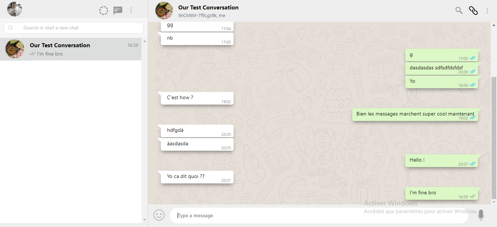

  

# WhatChat

A WhatsApp web simple clone using Elixir/Phoenix, VueJs and PostgreSQL.

## Screenshots

DEMO VIDEO v0: https://www.youtube.com/watch?v=Kha_Y7a4yrs

## Installation

To start your Phoenix server:

- Install dependencies with `mix deps.get`
- Create and migrate your database with `mix ecto.setup`
- Install Node.js dependencies with `cd assets && npm install`
- Start Phoenix endpoint with `mix phx.server`

## Features

- User authentication
- User registration
- 'Friends'/Groups Chat messages
- Profile settings 

Now you can visit [`localhost:4000`](http://localhost:4000) from your browser.

Ready to run in production? Please [check our deployment guides](https://hexdocs.pm/phoenix/deployment.html).

## Contacts

Get in touch with the authors

- TWITTER : https://twitter.com/Valdes_Che && https://twitter.com/Faymir
- EMAIL: valdesche03@gmail.com/

## Learn more

- Official website: http://www.phoenixframework.org/
- Guides: https://hexdocs.pm/phoenix/overview.html
- Docs: https://hexdocs.pm/phoenix
- Mailing list: http://groups.google.com/group/phoenix-talk
- Source: https://github.com/phoenixframework/phoenix
